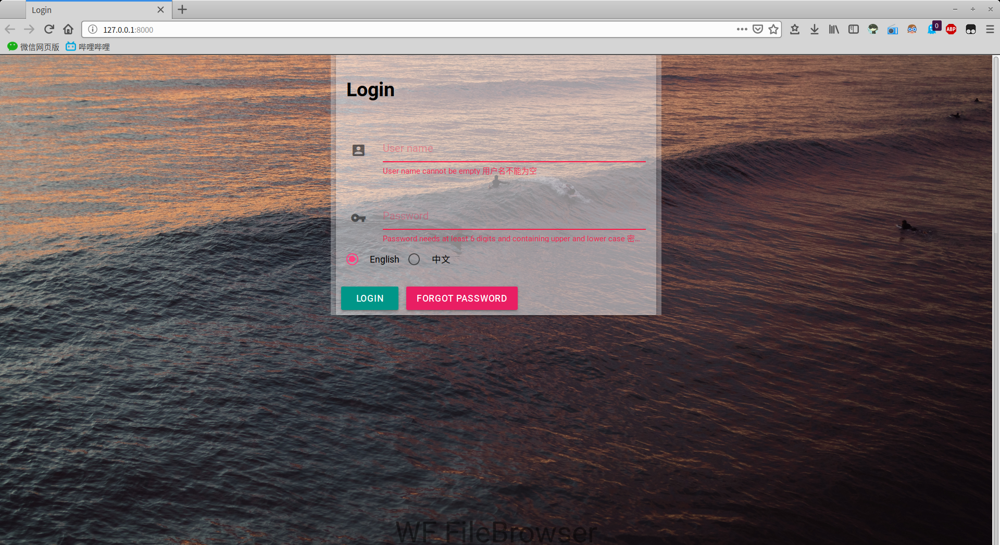
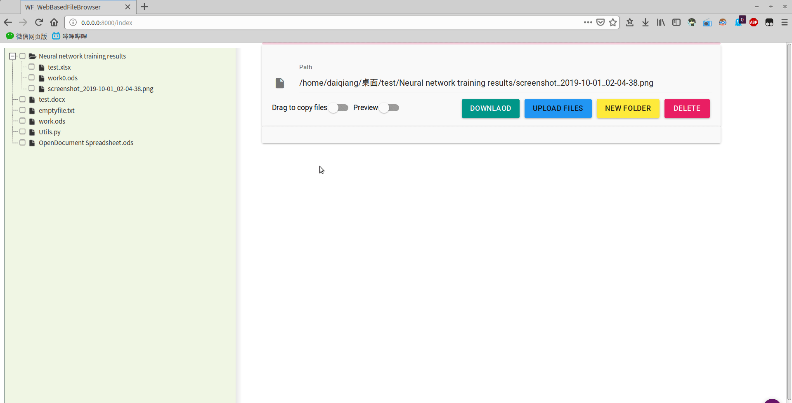
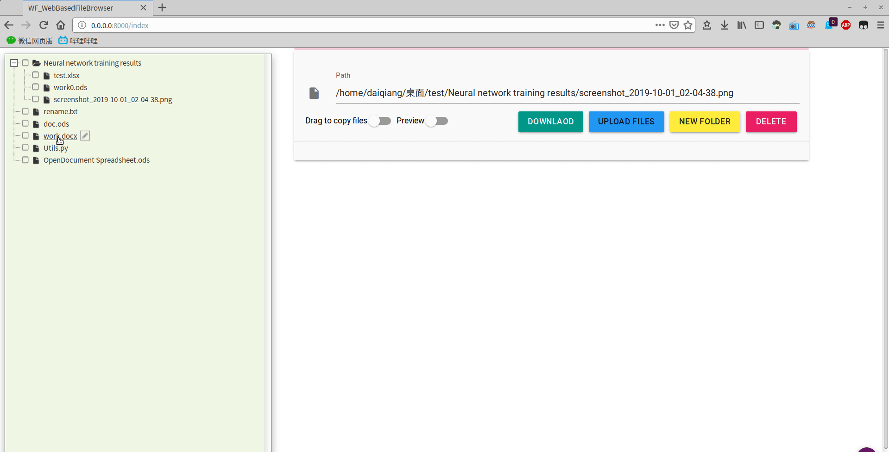
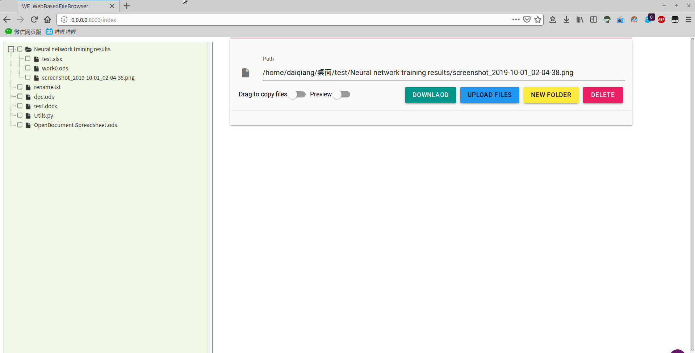
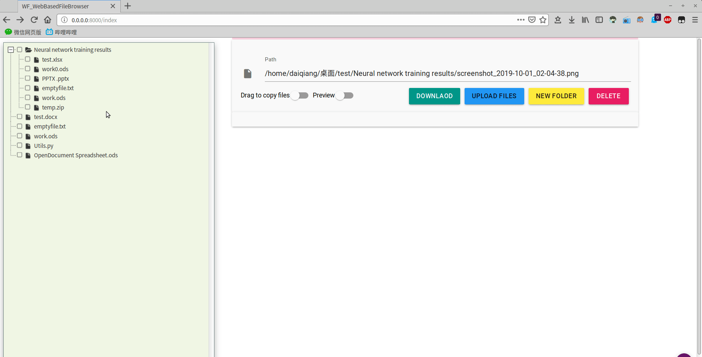

# WF FileBrowser

   
A user-friendly install easily WebBased File Browser programed with Python Django with Material Design Interface.  
一款美观易用性强快速部署的网页文件管理器，符合Google Material Design，采用Python语言 Django 框架编写。  
## English | [中文文档](./README/README_CN.md)
--------

Contact me | 
--------- |
DaiQiang: daiqianghaha@foxmail.com | 

## Login
 
## File Preview

## Drag to move or copy files

## Quickly rename files

## Delete files

# Advantage
* Quick configuration, one-click deployment, start the project immediately, python interpret runs without compiling.
* CSRF token authentication technology to prevent cross-site request forgery (CSRF) attacks.
* Asynchronous dynamic loading technology, can instantly render tens of thousands of files.
* File preview function Quickly view text files, project codes, and image files in various formats.
* Multi-file fast compression to zip for downloading.
* Customizable background image and other styles you love.

# Installation Guide
1. Download all files of the project
2. Run command in shell(Linux) cmd or powershell(windows)
  `pip install Django`
  If both python3 and python2 are installed in your PC, please run
     `pip3 install Django`

3. Modify `userdata.conf` in the app directory to configure the username and password.
Modify  `rootpath.conf` configuration in the app directory to configure your path which you want to manage files with WF file Browser.
4. Run command in shell(Linux) cmd or powershell(windows) to start the server
`python3 manage.py runserver 0.0.0.0:5210`

0.0.0.0 and 5210 can be replaced with custom IPs and ports when you needed

5. Web Browser access to 0.0.0.0:5201 to manage files
